# Proyecto de electrónica digital I  

Como proyecto final y dando cumplimiento con los requisitos planteados en el transcurso de la asignatura se plantearon 
los siguientes puntos:

- El sistema debe estar constituido de dos señales de entrada y dos de salida diferentes. 
- Para el procesamiento de las señales de entrada, se debe implementar las instrucciones en lenguaje Verilog con el fin 
de ingresar esta descripción de hardware a una tarjeta FPGA (Para nuestro proyecto una Altera Cyclone IV) y esta, a su 
vez se encargue enviar las señales de control a los componentes del sistema para que ejecuten los procesos establecidos 
de manera articulada.

## Contenido

- [Planteamiento del problema](#planteamiento-del-problema)
- [Descripción del Proyecto](#descripción-del-proyecto)
- [Requisitos del Modelo](#requisitos-del-modelo)
- [Funcionamiento del modelo](#funcionamiento-del-modelo)
- [Periféricos utilizados](#periféricos-utilizados)
- [Descripción en Verilog de periféricos](#descripción-en-verilog-de-periféricos)
- [Montaje físico](#montaje-físico)
- [Video de funcionamiento](#video-de-funcionamiento)
- [Presupuesto aproximado](#presupuesto-aproximado)
- [Participantes](#participantes)
- [Licencia](#licencia)

## Planteamiento del problema  

Unos de los mayores gastos en una empresa es el de mano de obra, el almacenaje y empaquetado de los productos, los 
desperdicios de materia prima y desperdicios del producto terminado que se generan por fallas en las líneas de 
producción, además del control de calidad en el proceso de producción. Para este caso se desea automatizar el proceso de 
empaque de los productos que se fabrican y a su vez el manejo del almacenamiento de estos previos al transporte a sus 
sitios de distribución, donde la dispensación de producto para llenado de envases y desplazamiento al lugar de 
almacenamiento se realiza de manera manual, proceso que puede ayudar a reducir costos, tener una mejora en los tiempos y 
control de calidad. 

## Descripción del Proyecto

Para este proyecto se implementará un sistema automatizado de llenado y transporte de empaques.   

Este proceso consta de dos fases, la primera es el desarrollo del sistema de dispensación, el cual constará de un 
cubículo donde se agregará el producto a dispensar, debajo de esta sección se encontrará separador de producto, donde se 
podrá individualizar cada elemento y almacenar hasta 9 unidades de producto; a partir de un motor paso a paso que estará 
conectado al separador, se permitirá el paso del producto para almacenar las unidades solicitadas a su caja de empaque. 

La fase dos corresponde a una banda transportadora que movilizará cada caja para que sea llenada y luego transportada a 
su lugar de distribución, este proceso tendrá una señalización de etapa de progreso y censado con la presencia de un 
depósito listo para ser llenado. 

Para el control de cada una de las etapas, se propone diseñar y desarrollar un modelo en lenguaje Verilog que cumpla con 
los requisitos a continuación

### Requisitos del Modelo

**Entradas**
- **Entrada 1:** Señal que indica la presencia de un empaque en la banda transportadora. Esta señal será recibida por 
medio de un módulo infra-rojo que enviará una señal de alto o bajo según sea el caso de la presencia de un depósito.
- **Entrada 2:** Señal que indica la cantidad de producto a ser dispensado en el depósito. Esta cantidad deberá ser 
proporcionada por el usuario por medio de un teclado matricial.
   
**Salidas**
- **Salida 1:** Señal que controla el mecanismo de dispensación para llenar el empaque. Se envía una señal a un motor 
paso a paso sincronizado para tener un máximo de 9 pasos por ciclo.
- **Salida 2:** Señal que señaliza la etapa de progreso del proceso de llenado. Esta señalización se realizará por 
medio de 3 LED que indicarán que el proceso está en la etapa de llenado, de transporte o ha llegado al final.
- **Salida 3:** Señal que controla el mecanismo de movimiento de la banda transportadora. El movimiento de la banda se 
controla a través de un motor que ayuda a la rotación de los rodillos de la banda y así transportar los depósitos.

### Funcionamiento del modelo 

**Detección de empaque**
- Cuando se detecta un empaque en la banda (Entrada 1), el sistema activa el proceso de llenado.
      
**Especificación de cantidad**
- El sistema solo inicia el proceso de llenado cuando hay un depósito listo para ser llenado y se ha especificado la 
cantidad de producto con la que se desea llenar el depósito (Entrada 2).
      
**Dispensación Automática**
- La salida 1 controla el mecanismo de dispensación, permitiendo el llenado automático hasta llegar al conteo 
determinado.
      
**Señalización de Progreso**
- La salida 2 señaliza las diferentes etapas del proceso de llenado, indicando el progreso del sistema.
      
**Transporte de depósitos**
- El sistema activa el movimiento de la banda transportadora cuando se ha cumplido el ciclo de llenado, enviando los 
contenedores a la zona de almacenado idealmente.

## Periféricos utilizados

- **Entrada 1:** Módulo de Proximidad Infrarrojo Evasor de Obstáculos FC-51.
    
    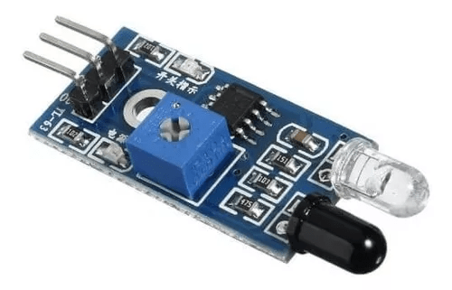
    
- **Entrada 2:** Teclado matricial de membrana 4x4.
    
  
    
- **Salida 1:** Motor Paso a Paso 28BYJ-48 + Módulo Driver Controlador
    
  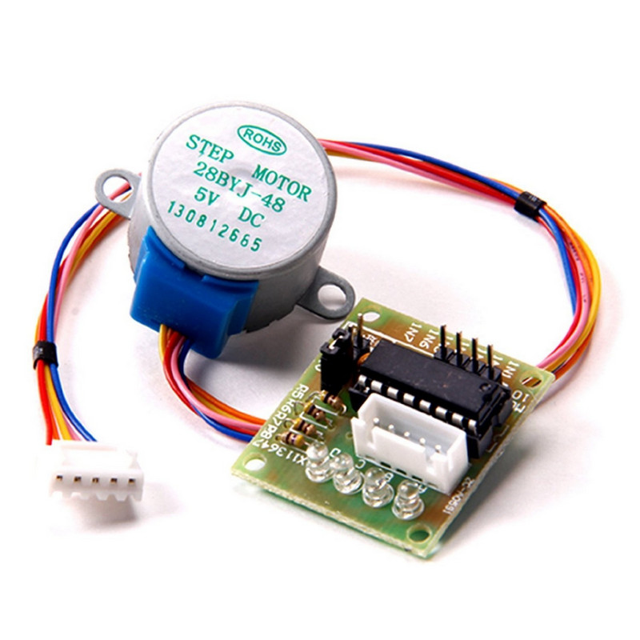
    
- **Salida 2:** Diodos LED Rojo, Amarillo, Verde
    
  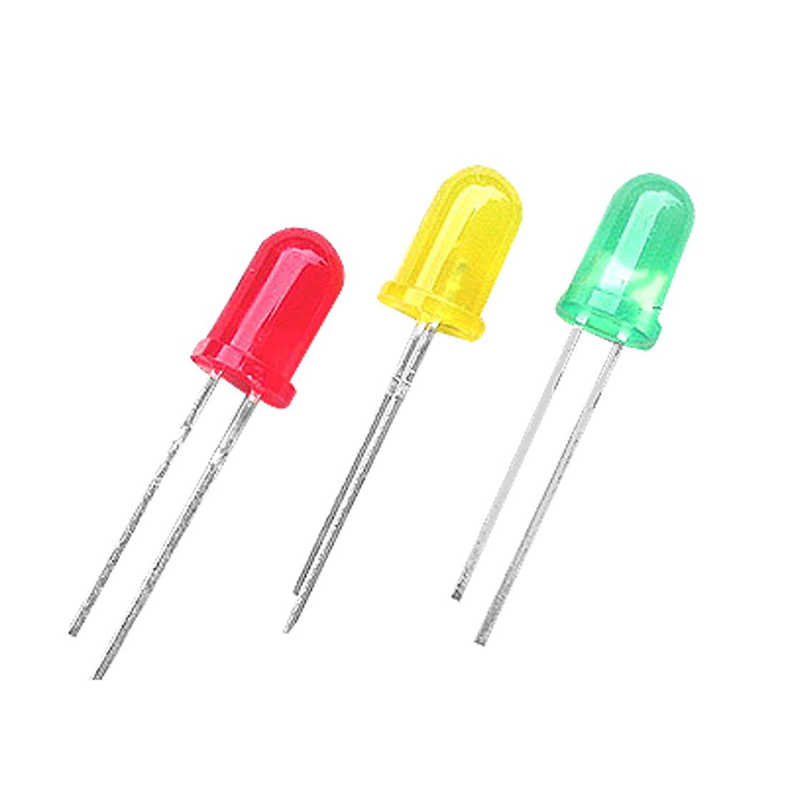
    
- **Salida 3:** Motor DC
    
  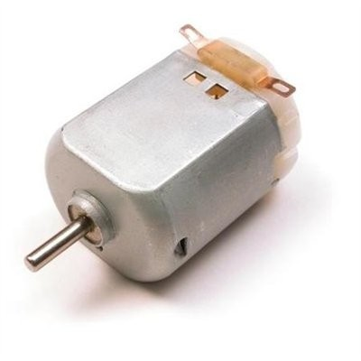

### Descripción del montaje 

Para la primera etapa se desarrolló el dispensador que está compuesto de 4 piezas:

Base o recipiente donde se almacenará el producto a dispensar, tendrá una abertura para el ingreso de unidad al 
dispensador, y otra abertura para el despacho de unidad de producto

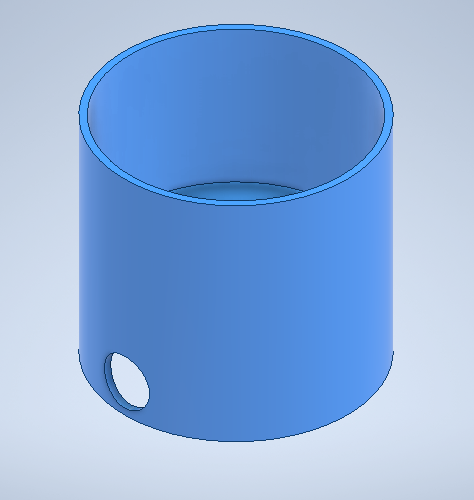

El dispensador almacenará máximo 9 unidades de producto por carga, el cual girará para llenado y entrega de producto.

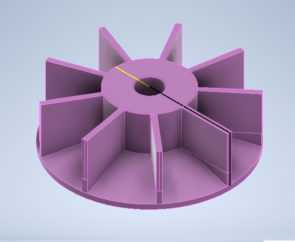

El eje conectará toda la estructura con el motor paso a paso para el giro del dispensador que permita que cada cubículo 
se oriente en la abertura de entrega de producto por cada unidad de tiempo.

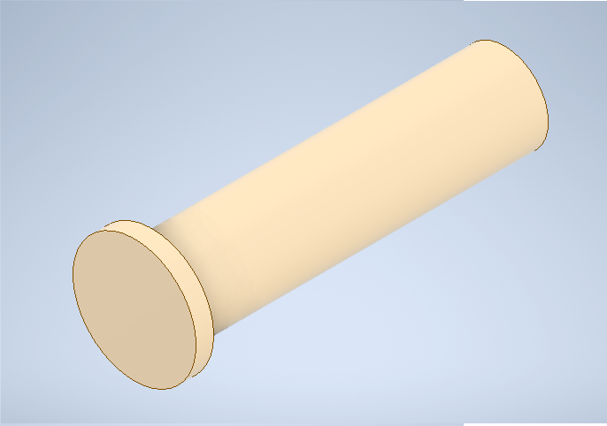

La escobilla es una pieza que genera movilidad del producto dentro del recipiente, permitiendo que no se atore el 
producto en la abertura de entrega.

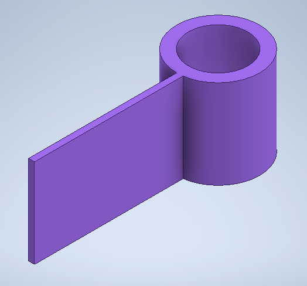

**Producto final de dispensador**

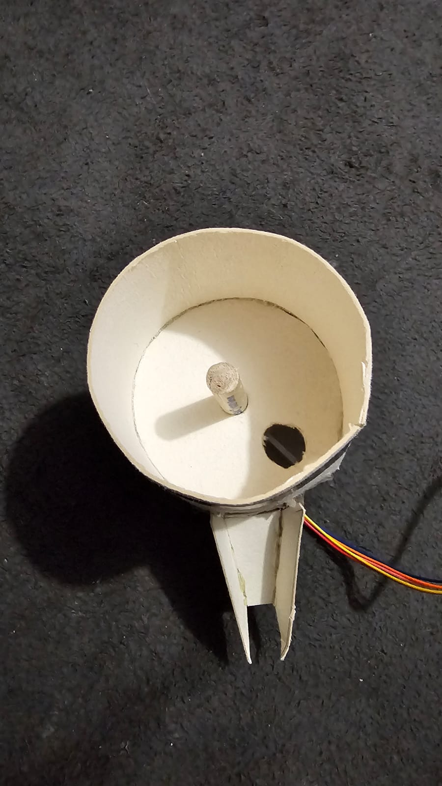  
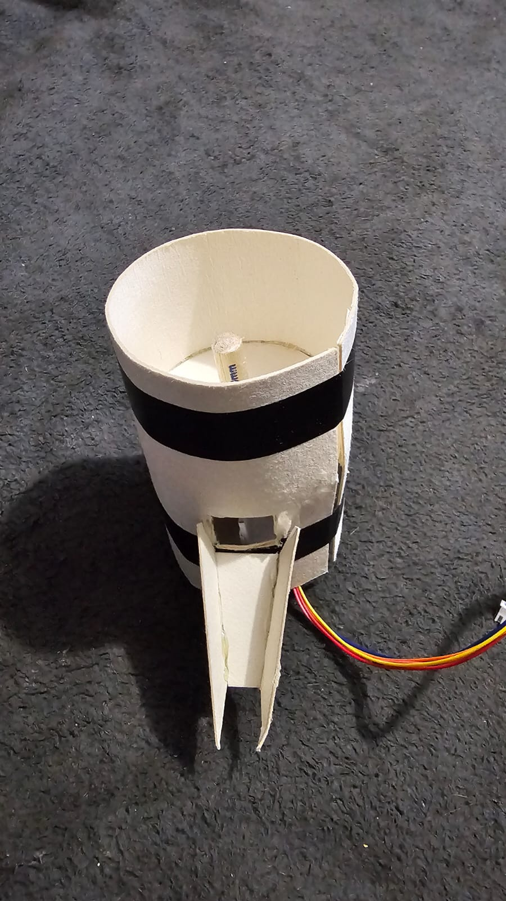

Para la segunda fase se creará la banda transportadora que tendrá una abertura para que el sensor infrarrojo pueda 
realizar la lectura de las cajas, permitirá el soporte del dispensador, y contará con la matriz para el ingreso de la 
cantidad a dispensar.

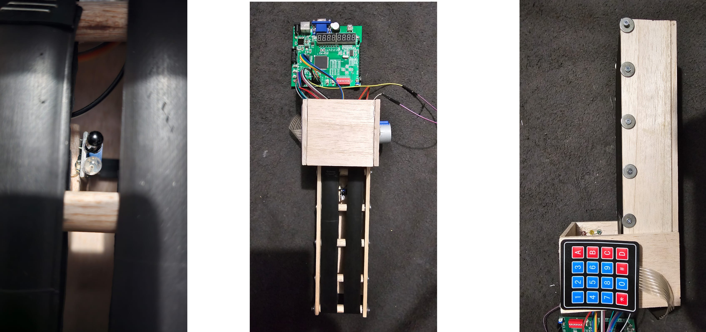

## Descripción en Verilog de periféricos 

Para describir cada periférico, se deben definir las señales de entrada y salida que cada uno va a tener. 
A continuación, se realiza la descripción en Verilog de cada uno de los periféricos mencionados y cómo están 
relacionados entre sí de manera general.

### 1. Modulo infrarrojo

 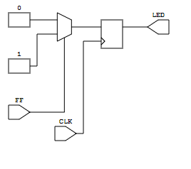

```
module modulo_infrarrojo(
  input wire in_sensor_banda, // Señal de entrada que indica la presencia de un empaque en la banda transportadora
  output wire out_dispensacion // Señal de salida que controla el mecanismo de dispensación
);

  // Lógica para activar la dispensación cuando se detecta un empaque en la banda
  assign out_dispensacion = in_sensor_banda;

endmodule
``` 

### 2. Teclado matricial 4x4 

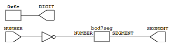

```
module teclado_matricial(
  input wire clk, // Señal de reloj 
  input wire [3:0] in_cantidad_producto, // Señal de entrada que indica la cantidad de producto a dispensar
  output wire out_progreso // Señal de salida que señaliza la etapa de progreso del proceso de llenado
);

  // Lógica para señalizar el progreso cuando se ha especificado la cantidad de producto
  assign out_progreso = (in_cantidad_producto > 0);

endmodule

``` 
### 3. Motor paso a paso 

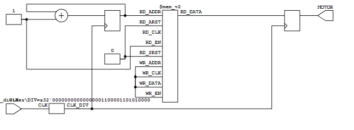

```
module motor_paso_a_paso(
  input wire clk, // Señal de reloj
  input wire [3:0] disp_steps, // Señal de entrada que indica el número de pasos de dispensación
  output wire out_dispensacion, // Señal de salida que controla el mecanismo de dispensación
  output wire [3:0] motor_steps // Señal de salida que controla el motor paso a paso
);

  // Lógica para activar la dispensación y controlar el motor paso a paso
  assign out_dispensacion = (disp_steps > 0);
  
  // Lógica para definir los pasos del motor según la cantidad de pasos de dispensación
  always @(posedge clk) begin
    case (disp_steps)
      1: motor_steps <= 4'b0001; // Primer paso
      2: motor_steps <= 4'b0010; // Segundo paso
      // ... se define el resto de los casos según la cantidad máxima de pasos
      default: motor_steps <= 4'b0000; // Se detiene el motor cuando no hay dispensación
    endcase
  end

endmodule
```

### 4. Diodos LED rojo, amarillo, verde 

 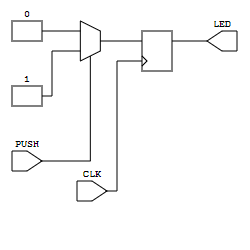
 ```
module leds(
  input wire in_progreso, // Señal de entrada que indica la etapa de progreso del proceso de llenado
  output wire [2:0] out_leds // Señal de salida que controla los LED's (Rojo, Amarillo, Verde)
);

  // Lógica para controlar los LED's según la etapa de progreso
  always @(*) begin
    case (in_progreso)
      0: out_leds = 3'b001; // Etapa de llenado (LED Verde encendido)
      1: out_leds = 3'b010; // Etapa de transporte (LED Amarillo encendido)
      2: out_leds = 3'b100; // Etapa final (LED Rojo encendido)
      default: out_leds = 3'b000; // Todos los LED's apagados
    endcase
  end

endmodule
```

### 5. Motor DC

```
module motor_dc_mini(
  input wire clk, // Señal de reloj
  input wire in_movimiento_banda, // Señal de entrada que controla el mecanismo de movimiento de la banda
  output wire out_movimiento_banda // Señal de salida que controla el motor DC mini
);

  // Lógica para controlar el movimiento del motor DC mini
  always @(posedge clk) begin
    if (in_movimiento_banda) begin
      // Lógica para activar el movimiento del motor en la dirección deseada
      // ...
    end else begin
      // Lógica para detener el movimiento del motor cuando no se requiere
      // ...
    end
  end

endmodule
```

### 6. Montaje completo

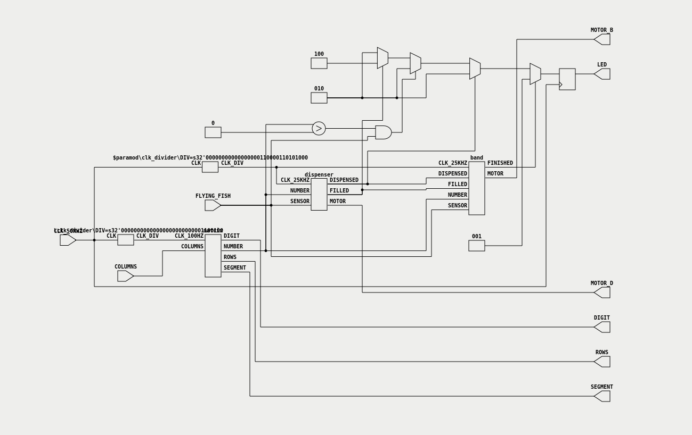

## Montaje físico 

Para realizar el montaje físico de la línea de llenado y la banda transportadora fue necesario construir una maqueta a 
escala de una línea de producción. Para esto se necesitaron varios materiales como lo son:

- Placa de balso de 50x5x910 mm
- Placa de balso de 75x5x910 mm
- Palos redondos y cuadrados de balso de 5 mm de grosor
- Caucho
- Cinta
- Tornillos y arandelas
- Silicona

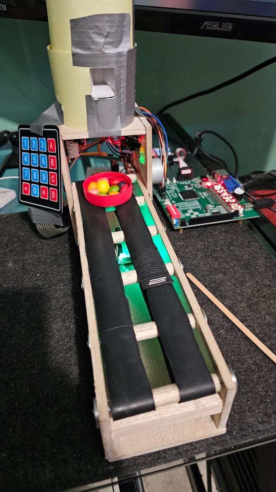

## Video de funcionamiento

https://drive.google.com/file/d/1tghtkQsvQXv7wupexkE4-K7s3kXEteOY/view?usp=drive_link

## Presupuesto aproximado 

| Material                                     | Descripción                                               | Cantidad | Precio Unitario (COP) | Costo Total (COP) |
|----------------------------------------------|-----------------------------------------------------------|----------|-----------------------|-------------------|
| Placas de Balso de 0.5cm de Grosor           | Material para la estructura y base del sistema            | 1        | $6.000                | $6.000            |
| Palos Redondos de Balso de 0.5cm de Grosor   | Reforzamiento y soporte para banda transportadora         | 1        | $6.000                | $6.000            |
| Palos Cuadrados de Balso de 0.5cm de Grosor  | Estructura y soporte adicional                            | 4        | $6.000                | $18.000           |
| Neumático de Llanta                          | Utilizado para la banda transportadora                    | 2        | $1.000                | $2.000            |
| Motor DC Mini 3000rpm                        | Motor para el movimiento de la banda transportadora       | 1        | $9.000                | $9.000            |
| Diodos LED Rojo, Amarillo, Verde             | Señalización de progreso del sistema                      | 3        | $300                  | $900              |
| Motor Paso a Paso 28BYJ-48 + Módulo Driver   | Control del mecanismo de dispensación                     | 1        | $20.000               | $20.000           |
| Teclado Matricial de Membrana 4x4            | Interfaz de usuario para ingresar la cantidad de producto | 1        | $7.000                | $7.000            |
| Módulo de Proximidad Infrarrojo Evasor FC-51 | Detección de empaque en la banda transportadora           | 1        | $5.000                | $5.000            |
| Tarjeta FPGA Altera Cyclone IV               | Tarjeta usada para comunicación de periféricos            | 1        | $2.363.777            | $2.363.777        |
| **Total**                                    |                                                           |          | **Aproximadamente:**  | **$2.407.713**    |


## Participantes

- [Alvaro Arturo Montenegro Silva](https://github.com/aamontenegros)
- [Juan Manuel Rojas Luna](https://github.com/JuanLunaG)
- [Juan David Vega Avila](https://github.com/JuanD272)

## Licencia

GNU General Public License v3.0. Consulte el [Archivo de licencia](LICENSE) para obtener más información.
